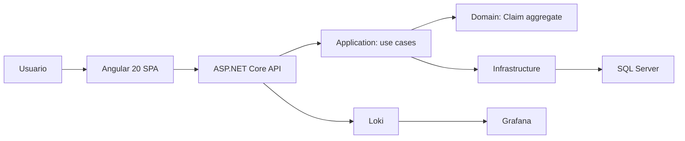
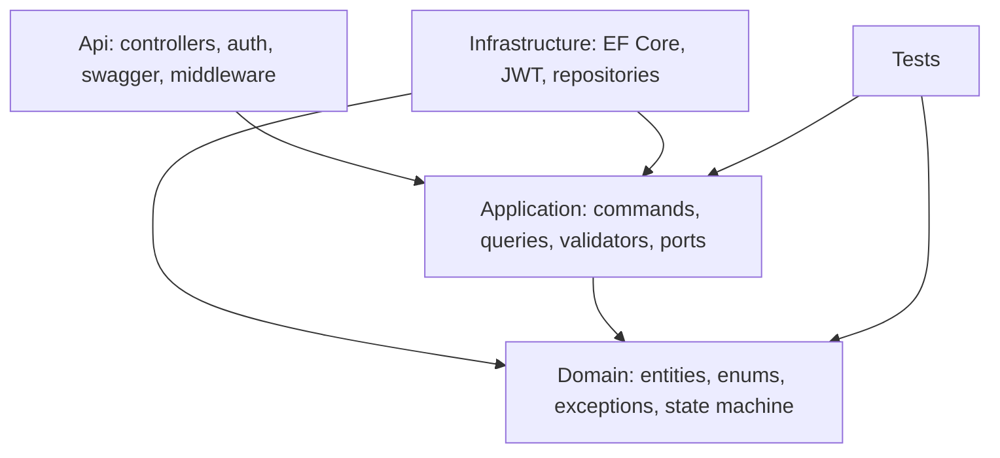
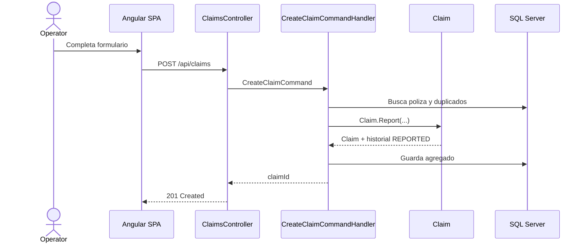
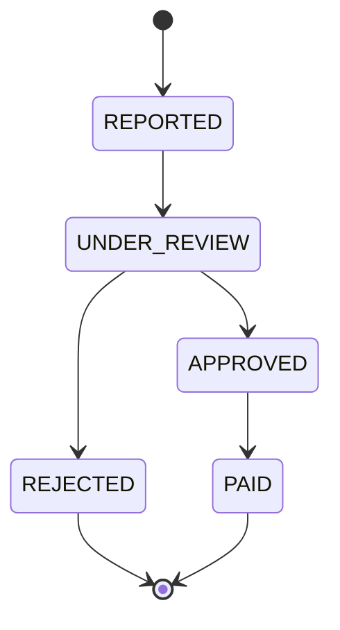

# Architecture

## Vision General

SeguraVida Claims se implementa como monorepo con separacion clara entre backend, frontend, infraestructura y documentacion. El backend sigue Clean Architecture con DDD tactico; el frontend usa feature folders y facades con signals.

## Clean Architecture

Las dependencias apuntan hacia el dominio. `Domain` no conoce frameworks, persistencia ni HTTP.

## DDD Tactico

El agregado `Claim` protege invariantes:

- poliza vigente en fecha de incidente;
- fecha de incidente menor o igual a fecha de reporte;
- monto reclamado menor o igual a suma asegurada;
- transiciones validas;
- aprobacion con monto y notas de peritaje;
- historial obligatorio por cada cambio de estado.

Los metodos de negocio son `StartReview`, `Approve`, `Reject` y `MarkAsPaid`. No se exponen setters publicos indiscriminados para campos criticos.

## Flujo De Registro

## Flujo De Cambio De Estado

Cada transicion agrega un registro en `CLAIM_STATUS_HISTORY` desde el dominio y se persiste en la misma unidad de trabajo.

## Seguridad

La API usa JWT Bearer mock. Roles:

- `OPERATOR`: registra y consulta.
- `ADJUSTER`: consulta, inicia revision, aprueba, rechaza y paga.
- `AUDITOR`: solo lectura, historial y reportes.

Los controllers aplican autorizacion por rol y delegan reglas a Application/Domain.

## Observabilidad

Serilog emite JSON compacto a consola y, en Docker, envia eventos a Loki. Grafana se provisiona con datasource y dashboard. Los logs de negocio usan identificadores tecnicos y `CorrelationId`, sin datos personales sensibles.
