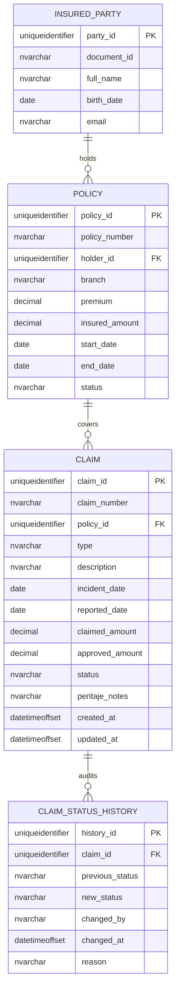

# Database Model

## Decision Oracle XE vs SQL Server

El challenge menciona Oracle como base objetivo posible. Para este take-home se eligio SQL Server en Docker como motor relacional equivalente.

Motivo:

- SQL Server Docker es mas liviano y predecible para levantar localmente.
- EF Core tiene provider oficial y estable.
- Reduce friccion de evaluacion sin cambiar las decisiones relacionales del modelo.

Como migrar a Oracle:

- Cambiar `Microsoft.EntityFrameworkCore.SqlServer` por el provider Oracle EF Core.
- Ajustar connection string.
- Regenerar migraciones para Oracle.
- Revisar tipos `uniqueidentifier`, `datetimeoffset`, `decimal` y `date`.
- Reescribir el stored procedure `dbo.GetClaimsSummary` como PL/SQL.
- Revisar scripts SQL generados bajo `infra/docker/sqlserver`.

## Entidades



### INSURED_PARTY

Campos:

- `party_id` PK.
- `document_id` unico, dato personal sensible.
- `full_name`, dato personal sensible.
- `birth_date`.
- `email`, dato personal sensible.

### POLICY

Campos:

- `policy_id` PK.
- `policy_number` unico.
- `holder_id` FK a `INSURED_PARTY.party_id`.
- `branch`: `AUTO`, `LIFE`, `HEALTH`, `HOME`.
- `premium`.
- `insured_amount`.
- `start_date`.
- `end_date`.
- `status`: `ACTIVE`, `EXPIRED`, `CANCELLED`.

### CLAIM

Campos:

- `claim_id` PK.
- `claim_number` unico.
- `policy_id` FK a `POLICY.policy_id`.
- `type`.
- `description`.
- `normalized_description`.
- `incident_date`.
- `reported_date`.
- `claimed_amount`.
- `approved_amount`.
- `status`: `REPORTED`, `UNDER_REVIEW`, `APPROVED`, `REJECTED`, `PAID`.
- `peritaje_notes`.
- `created_at`.
- `updated_at`.
- `created_by`.

### CLAIM_STATUS_HISTORY

Campos:

- `history_id` PK.
- `claim_id` FK a `CLAIM.claim_id`.
- `previous_status`.
- `new_status`.
- `changed_by`.
- `changed_at`.
- `reason`.

### MOCK_USER

Tabla de soporte para la autenticacion mock:

- `operator@seguravida.com` con rol `OPERATOR`.
- `adjuster@seguravida.com` con rol `ADJUSTER`.
- `auditor@seguravida.com` con rol `AUDITOR`.

## Indices

Implementados:

- `IX_POLICY_POLICY_NUMBER` sobre `POLICY.policy_number`.
- `IX_INSURED_PARTY_DOCUMENT_ID` sobre `INSURED_PARTY.document_id`.
- `IX_CLAIM_STATUS` sobre `CLAIM.status`.
- `IX_CLAIM_INCIDENT_DATE` sobre `CLAIM.incident_date`.
- `IX_CLAIM_REPORTED_DATE` sobre `CLAIM.reported_date`.
- `IX_CLAIM_POLICY_ID` sobre `CLAIM.policy_id`.
- `IX_CLAIM_STATUS_HISTORY_CLAIM_ID` sobre `CLAIM_STATUS_HISTORY.claim_id`.

Adicional:

- `IX_CLAIM_CLAIM_NUMBER` sobre `CLAIM.claim_number`.
- `IX_MOCK_USER_EMAIL` sobre `MOCK_USER.email`.

## Auditoria

Se eligio auditoria por logica de aplicacion/dominio.

`Claim` expone metodos de negocio (`StartReview`, `Approve`, `Reject`, `MarkAsPaid`) y cada transicion agrega un `ClaimStatusHistory`. La persistencia guarda el agregado y su historial en una misma unidad de trabajo.

Ventaja:

- reglas testeables sin base de datos;
- trazabilidad explicita;
- evita triggers ocultos como unica fuente de auditoria.

En un escenario regulado real se podria complementar con triggers, CDC o temporal tables para auditoria defensiva ante cambios directos en base.

## Seed

La migracion inicial carga:

- 5 asegurados.
- 8 polizas.
- 10 siniestros en estados variados.
- historial para cada siniestro.
- 3 usuarios mock por rol.

Los datos sensibles existen en base para simular un dominio real, pero no deben registrarse en logs en claro.

## Reporte agregado

Se implementa el stored procedure SQL Server:

```sql
EXEC dbo.GetClaimsSummary @FromDate = '2026-06-01', @ToDate = '2026-06-05';
```

Devuelve:

- ramo (`Branch`);
- estado (`Status`);
- total de siniestros (`TotalClaims`);
- monto pagado (`PaidAmount`), calculado desde `approved_amount` solo para estado `PAID`.

Filtros:

- `@FromDate` opcional sobre `CLAIM.reported_date`;
- `@ToDate` opcional sobre `CLAIM.reported_date`.

## Archivos

- `ClaimsDbContext`: `src/backend/SeguraVida.Claims.Infrastructure/Persistence/ClaimsDbContext.cs`.
- Configuraciones EF: `src/backend/SeguraVida.Claims.Infrastructure/Persistence/Configurations`.
- Migracion inicial: `src/backend/SeguraVida.Claims.Infrastructure/Persistence/Migrations`.
- Script idempotente: `infra/docker/sqlserver/001-initial-create.sql`.
